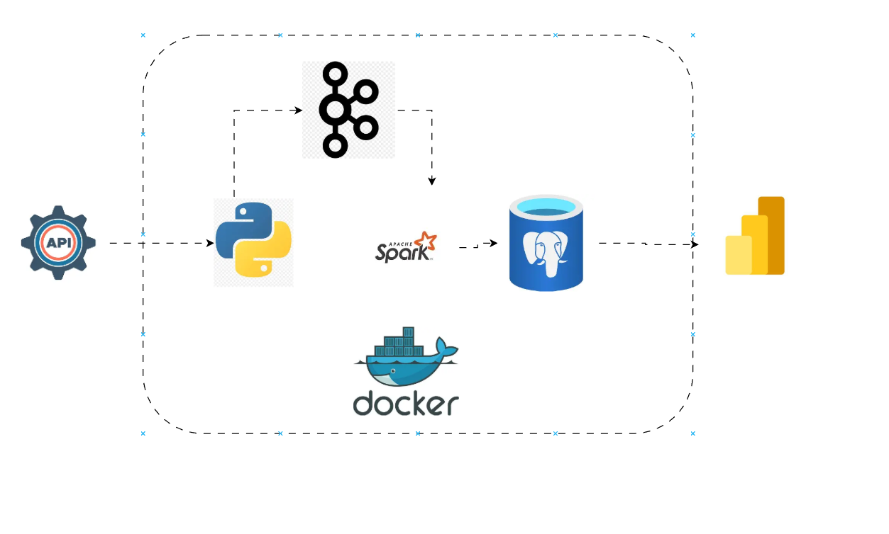
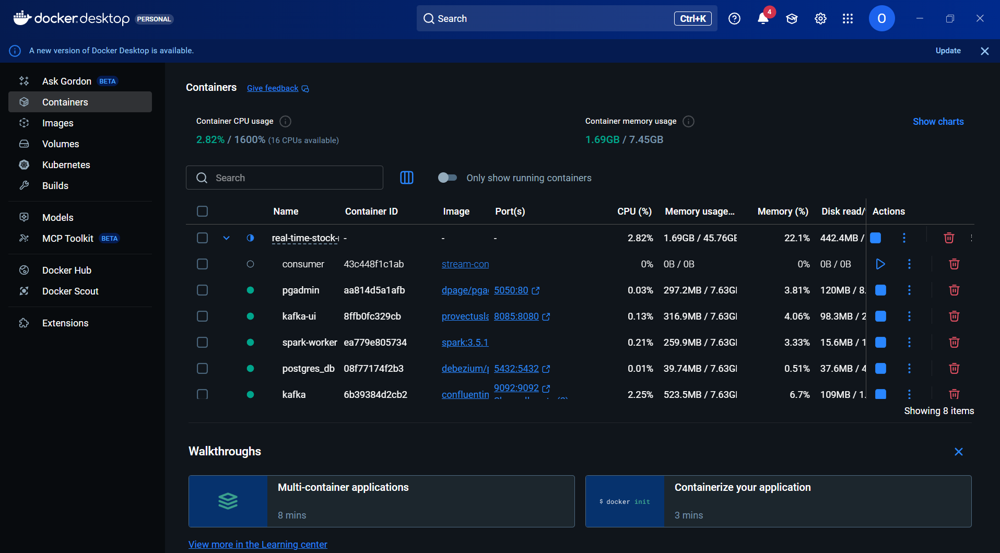
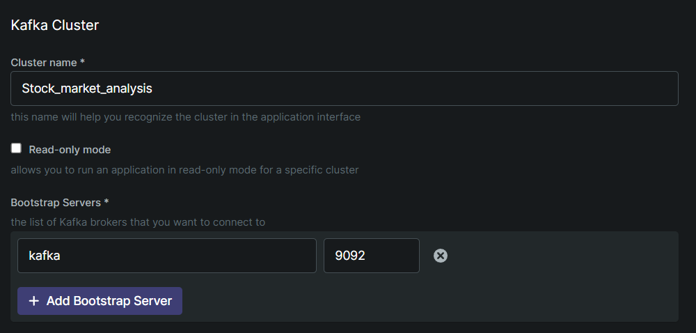

# Real-Time Stock Market Analysis Pipeline

## 📖 Overview
This project is a complete **Real-Time Data Engineering Pipeline** designed to ingest, process, and analyze stock market data as it happens. It demonstrates how to build a scalable architecture using industry-standard tools for streaming data.

**What does it do?**
1. **Fetches** live stock data (e.g., MSFT, GOOGL, TSLA) every minute.
2. **Streams** this data into a Kafka cluster.
3. **Processes** the stream using Apache Spark to structure and clean the data.
4. **Stores** the refined data into a PostgreSQL database for historical analysis.

---

## Business Aspect
MarketPulse Analytics, based in New York, USA, is a leading provider of real-time financial data analytics, helping institutional investors make informed decisions.
Aim : This project aims to build a scalable and efficient real-time data pipeline by processing it real-time, storing it in a scalable database and delivering insights on dashboards.

## Business Problem and Solution
- Reliability Shortfall: The platform lacks comprehensive, production-grade monitoring and alerting, making it difficult to detect, diagnose, and resolve operational anomalies in real time.

- The existing infrastructure cannot elastically handle surges in data  volume, causing throughput degradation and processing backlogs during peak market activity.

Solution

#### Impact on the Business
- Financial: Latency and unreliable processing translate directly to suboptimal trading signals, missed market opportunities, and quantifiable revenue loss.
- Competitive: Inability to guarantee real-time performance undermines MarketPulse’s value proposition versus competitors that deliver faster, more reliable signals.
- Regulatory & Client Risk: Delayed or inaccurate reporting jeopardizes compliance obligations and exposes institutional clients to audit and legal risk.


## 🏗️ Architecture & Data Flow



The pipeline flows from left to right:
1. **API (Source)**: We use the **Alpha Vantage API** (via RapidAPI) to get the latest stock stats.
2. **Producer**: A Python script (`producer/main.py`) acts as the "Producer," sending these records to Kafka.
3. **Message Broker**: **Apache Kafka** serves as the central hub, receiving data and buffering it for consumers.
4. **Stream Processing**: **Apache Spark** (in `consumer/consumer.py`) reads from Kafka, defines the schema (Open, Close, High, Low), and acts as the "Consumer."
5. **Storage**: Spark writes the processed data into **PostgreSQL**.
6. **Visualization**: You can view the data using **PgAdmin** or connect tools like **PowerBI**.

---

## 🛠️ Technology Stack
- **Python**: The primary language for our Producer and Spark Consumer.
- **Apache Kafka**: A distributed event streaming platform used for high-performance data pipelines.
- **Apache Spark**: A unified analytics engine for large-scale data processing (we use Spark Structured Streaming).
- **PostgreSQL**: An advanced, enterprise-class open-source relational database.
- **Docker**: Used to containerize every component, ensuring the project runs the same on any machine.
- **Kafka UI**: A web interface to monitor Kafka brokers and topics.
- **PgAdmin**: A web interface to manage the PostgreSQL database.

---

## ✅ Prerequisites
Before you begin, ensure you have the following installed:
- **Docker** and **Docker Compose**: [Download Docker Desktop](https://www.docker.com/products/docker-desktop/)
- **Git**: [Download Git](https://git-scm.com/downloads)
- A **RapidAPI Account** and Key for Alpha Vantage: [Subscribe here (Free)](https://rapidapi.com/alphavantage/api/alpha-vantage)

---

## 🚀 Installation & Setup

### 1. Clone the Repository
Open your terminal and clone the project code:
```bash
git clone https://github.com/yourusername/REAL-TIME-STOCK-MARKET-ANALYSIS.git
cd REAL-TIME-STOCK-MARKET-ANALYSIS
```

### 2. Configure Environment Variables
You need to provide your API key so the Producer can fetch data.
1. Create a file named `.env` in the root directory (if it doesn't exist).
2. Add your RapidAPI key:
```env
  # Create a .env file in project root directory
  API_KEY=ADD API KEY
  POSTGRES_USER=admin
  POSTGRES_PASSWORD=admin
  PGADMIN_DEFAULT_EMAIL=sample@admin.com
  PGADMIN_DEFAULT_PASSWORD=admin
```

### 3. Activation of the Virtual Environment

```bash
  python -m venv venv
  source venv/Scripts/activate
```
### 4. Install the necessary Dependencies
  ```bash
  pip install -r requirements.txt
```
### 5. Run your Docker Services
- Open your Docker Desktop
  
  
```bash
docker compose up -d
```


## 🏃 Usage Guide

### verifying the Pipeline is Running
Once the containers are up, the data should start flowing automatically. Only the `producer` and `consumer` are custom applications; the rest are infrastructure.

#### 1. Check the Producer
The producer fetches data and sends it to Kafka. Check its logs to see if it's working:
```bash
docker logs -f producer
```
*You should see "Data sent: MSFT..." messages.*

#### 2. Check Kafka (Intermediate)
Open your browser and go to the **Kafka UI**:
👉 **http://localhost:8085**



- Click on **Consumers** or **Topics**.
- You should see the topic `stock_analysis` receiving messages.

#### 3. Check the Consumer (Spark)
The consumer reads from Kafka and writes to the DB. Check its logs:
```bash
docker logs -f consumer
```
*Look for "Batch: 0", "Batch: 1" indicates it is processing micro-batches.*

#### 4. Verify Data in PostgreSQL
Open **PgAdmin** to inspect the database:
👉 **http://localhost:5050**

- **Email**: `admin@admin.com`
- **Password**: `admin`

1. Right-click on **Servers** > **Register** > **Server**.
2. **Name**: `Local Postgres`
3. **Connection** tab:
   - **Host name**: `postgres` (this is the docker service name)
   - **Username**: `admin`
   - **Password**: `admin`
4. Save and navigate to `Databases` > `stock_data` > `Schemas` > `public` > `Tables`.
5. You should see a `stocks` table. Right-click it and select **View/Edit Data** > **All Rows**.

---

## 📂 Detailed File Breakdown
This section explains exactly what each file in the project does.

### 1. Root Directory
- **`compose.yml`**: The Docker Compose configuration. It orchestrates the entire system by defining services:
  - `zookeeper`: Manages the Kafka cluster state.
  - `kafka`: The message broker.
  - `spark-master` & `spark-worker`: The Spark cluster for processing.
  - `postgres`: The database for storage.
  - `kafka-ui` (port 8085): Web UI to inspect Kafka.
  - `pgadmin` (port 5050): Web UI to inspect Postgres.
  - `producer`: The custom container running our Python producer code.
  - `consumer`: The custom container running our Spark consumer code.
- **`README.md`**: The documentation you are reading right now.
- **`requirements.txt`**: Lists Python libraries needed for the local environment (e.g., `kafka-python`, `requests`).
- **`.env`**: Stores sensitive information like your `API_KEY`. **Do not commit this file to Git.**

### 2. `producer/` Directory
This directory contains the code that fetches data and sends it to Kafka.
- **`main.py`**: The "engine" of the producer.
  - It runs an infinite loop that calls `connect_to_api` every minute.
  - receives the JSON response and loops through each stock.
  - Sends each stock record to the Kafka topic `stock_analysis`.
- **`extract.py`**: Handles the logic for connecting to the Alpha Vantage API.
  - `connect_to_api()`: Sends the HTTP GET request to the API.
  - `extract_json()`: Parses the complex API response into a clean dictionary.
- **`config.py`**: A configuration file that loads environment variables (like `API_KEY`) and sets up logging format.
- **`producer_setup.py`**: Configures the Kafka Producer.
  - Sets the bootstrap server to `localhost:9094` (for external access) or `kafka:9092` (internal).
  - Defines the `stock_analysis` topic name.

### 3. `consumer/` Directory
This directory contains the Spark job that processes the stream.
- **`consumer.py`**: The main Spark Application.
  - Initializes a `SparkSession`.
  - Defines the `kafka_data_schema` (Date, Open, High, Low, Close, Symbol).
  - Reads from the Kafka stream `stock_analysis`.
  - Uses `foreachBatch` to write data into the PostgreSQL `stocks` table.
- **`Dockerfile`**: Defines how to build the `consumer` docker image. It starts with a base Spark image (`spark:3.5.1-python3`) and adds our code.

---

## 🔧 Troubleshooting

**Q: The Producer logs say "Error connecting to API"**
- A: Check your `.env` file. Ensure `API_KEY` is correct and you have subscribed to the Alpha Vantage API on RapidAPI.

**Q: Converting string to Timestamp errors in Spark**
- A: Ensure the date format coming from the API matches what Spark expects. The code currently casts the date string directly; verify the API response format hasn't changed.

**Q: Docker containers exit immediately**
- A: Run `docker-compose logs [service_name]` to see why. often it is a memory issue. Ensure your Docker Desktop has at least 4GB of RAM allocated.

---

## 🤝 Contributing
Contributions are welcome!
1. Fork the repository.
2. Create a new branch (`git checkout -b feature/AmazingFeature`).
3. Commit your changes (`git commit -m 'Add some AmazingFeature'`).
4. Push to the branch (`git push origin feature/AmazingFeature`).
5. Open a Pull Request.

## 📄 License
Distributed under the MIT License. See `LICENSE` for more information.
